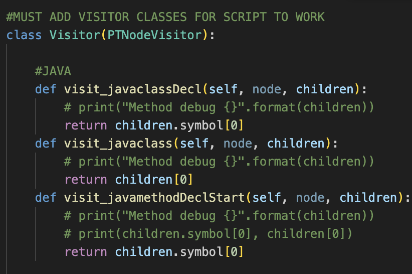

<h3 align="center">Documentation Generation tool</h3>

  <p align="center">
    Prototype created using Telus GenAI API or OpenAI API that inserts inline code documentation into selected files or onto the entire repository. 
    Currently works with documenting Python, Java, Art (Code Realtime), Makefiles, TypeScript, PHP and C++ files.
  </p>
</div>


<!-- TABLE OF CONTENTS -->
<details>
  <summary>Table of Contents</summary>
  <ol>
    <li>
      <a href="#about-the-project">About The Project</a>
    </li>
    <li>
      <a href="#installation">Installation</a>
    </li>
    <li><a href="#usage">Usage</a></li>
        <li><a href="#llm">LLM-as-judge Evaluation</a></li>

  </ol>
</details>


### Installation (Local Use)

1. Get an API key for Telus GenAI or a public one from https://platform.openai.com/account/api-keys 
2. Clone the repo
   <!-- ```sh
   git@github.com:nathanaelyao/Header-Comment-Generation.git
   ``` -->
3. Enter your API keys in `tinaa/doc_gen/config.yaml`.
   ```sh
   OPENAI_API_KEY: examplekey #replace with working key
   GEMINI_KEY: examplekey  #replace with working key
   ```
4. To download the required dependencies, run the following command in the terminal:
   ```sh
   poetry install
   ```

### Installation (Gitlab CI)

1. Enable the public_deploy_key_nathanael deploy key from the repository settings on Gitlab (or add your own deploy key and change)

2. Add the following to the repositories CI/CD variables in Gitlab settings: MAINTAINER_KEY, DEPLOY_KEY, OPENAI_API_KEY, TOKEN. The OPENAI_API_KEY can be created at https://platform.openai.com/account/api-keys.

3. The pipeline is triggered when a new merge request is made or when new changes are pushed to an existing merge request.

### Setup

To add support for a new language, follow these instructions: 
1. Enter Information about languages you wish to document in `tinaa/doc_gen/languages.json`
    - Make sure that the name of the language in `tinaa/doc_gen/languages.json` matches the name of a treesitter parser found in: https://tree-sitter.github.io/tree-sitter/
2. Enter a new Jinja template describing the documentation format at `tinaa/doc_gen/jinja_templates/language_doc_templates` if using a new documentation format.
3. If no Treesitter parser is available for a language, create grammars describing the elements you want to document at `tinaa/doc_gen/parsing/arpeg.py`:
    - Add Arpeggio grammars
    

    - Add a visitor functions in the Visitor Class
    

### Usage
The script that inserts the documentation is at `tinaa/doc_gen/add_documentation.py`. The prompts are in the `tinaa/doc_gen/jinja_templates`.

- To run the script on every file in the directory, run this command from the terminal:
   ```sh
   python3 -m tinaa.doc_gen.add_documentation -public
   ```
- To run the script on a specific python file, run this command from the terminal:
   ```sh
   python3 -m tinaa.doc_gen.add_documentation example_file.py -public
   ```